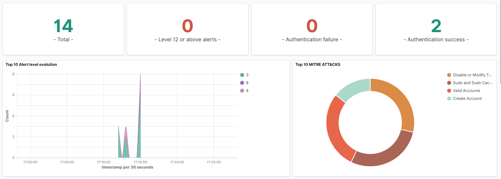
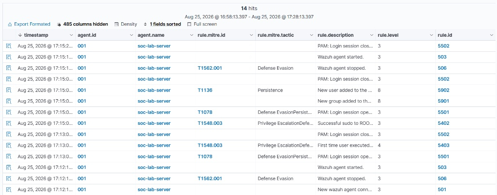
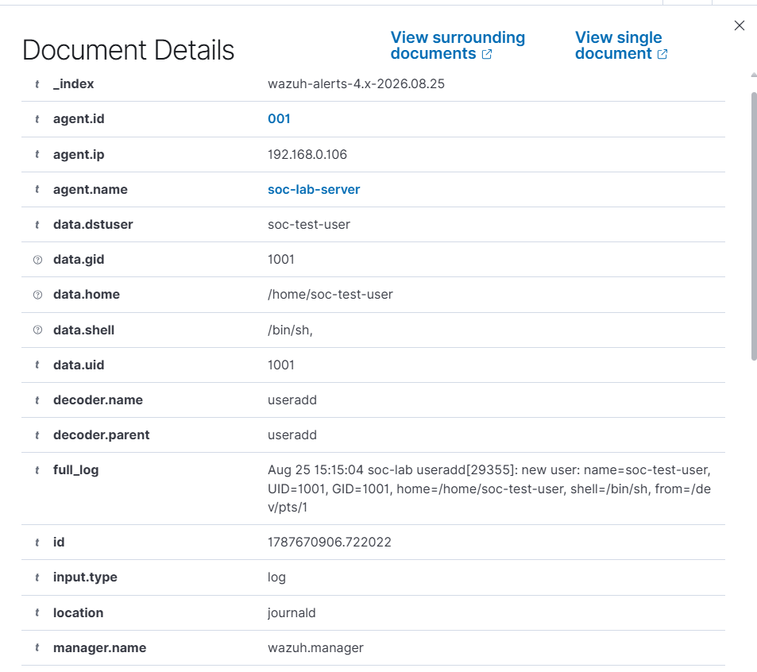
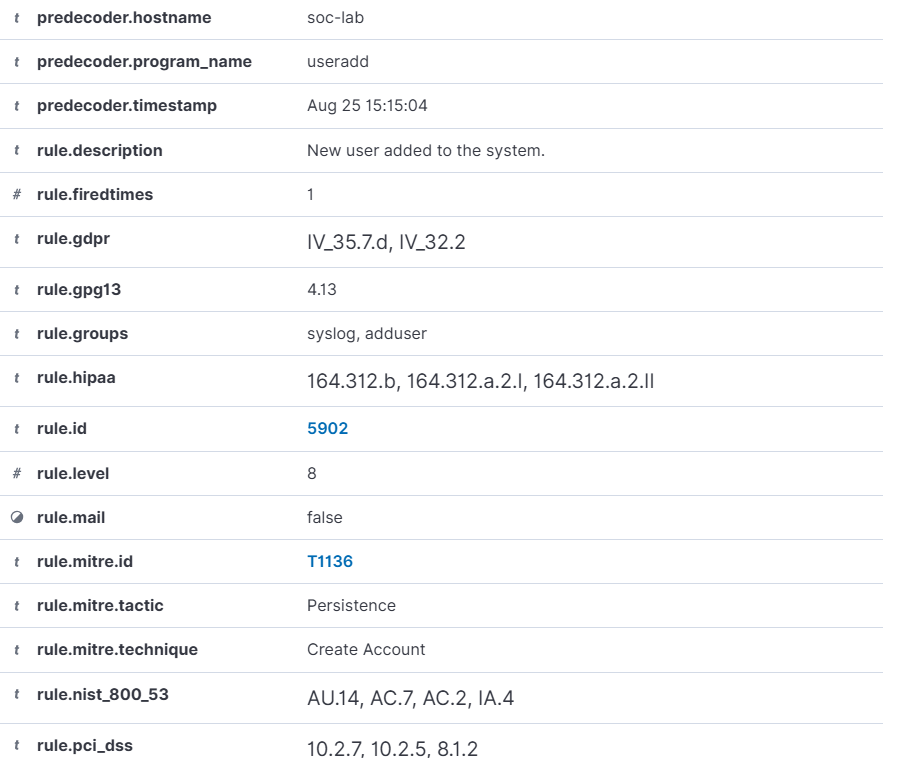
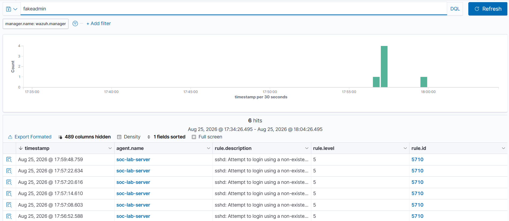
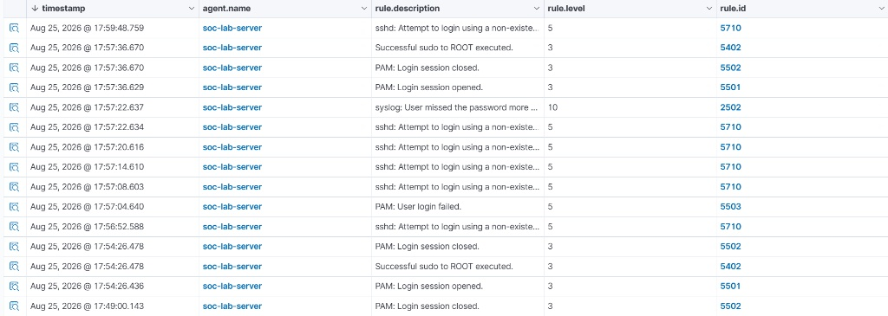

# Building My SOC Homelab 

Welcome to my cybersecurity homelab project! I started this lab to get practical, hands-on experience with system hardening, SIEM platforms, log analysis, and threat detection.

Here is how I built the entire environment step by step.
---
## 1. Hardware & Operating System
I repurposed an old Dell OptiPlex PC into a dedicated 24/7 Linux server.

* **OS:** Ubuntu Server 24.04 LTS
* **Setup:** Headless configuration 100% managed via SSH from Windows Terminal.
* **Network:** Assigned a static IP 192.168.0.106 on my local network for reliable access.
---
## 2. Initial Setup 
Before deploying any security tools, I secured the host:

1. **System Updates:** Updated repositories and packages (`apt update && apt upgrade`).
2. **Firewall (UFW):**
   * Blocked all incoming traffic by default "default deny incoming".
   * Allowed outgoing traffic "default allow outgoing".
   * Whitelisted port "22" for SSH remote access.
3. **Brute-Force Defense:** Installed and enabled **Fail2ban** to automatically detect and ban failed SSH login attempts.
4. **Kernel Tuning:** Increased "vm.max_map_count=262144" in "/etc/sysctl.conf" to meet memory requirements for log indexing.
---
## 3. Deploying Wazuh SIEM with Docker

I chose Docker to keep services isolated and lightweight:

1. Installed Docker Engine and Docker Compose.
2. Cloned the Wazuh repository and generated local SSL certificates.
3. Allowed port "443" (HTTPS) through UFW for the web dashboard.
4. Spun up the entire Wazuh stack using Docker Compose.

The SIEM dashboard is now live and accessible at `https://192.168.0.106`.
---
##  Detection Test: MITRE ATT&CK T1136

To validate the detection pipeline, I simulated unauthorized local account creation on the host server:

1. **Trigger:** Created a test account via CLI (`sudo useradd soc-test-user`).
2. **Dashboard Overview:** Wazuh immediately captured the spike in Level 8 alerts and classified the technique under *Persistence*.
   
   

3. **Event Correlation:** Filtered the events table to trace privilege escalation and user management actions.
   
   

4. **Alert & Payload Triage:** Inspected raw log fields (`useradd` decoder parsed target user `soc-test-user`).
   
   

5. **MITRE Mapping:** Verified Rule `5902` (Level 8) mapped directly to **T1136.001 - Create Account: Local Account**.
   
   

---

##  Detection Test: MITRE ATT&CK T1110 (SSH Brute-Force & IPS Defense)

To test event correlation and automated intrusion prevention, I simulated an SSH brute-force attack from a local workstation (`192.168.0.102`) targeting the server (`192.168.0.106`):

1. **Attack Simulation:** Generated multiple invalid SSH login attempts using arbitrary credentials (`fakeadmin`).
2. **Initial Detection (Level 5):** Wazuh captured repeated individual failed authentications under Rule `5710`.
   
   

3. **SIEM Rule Correlation (Level 10):** The correlation engine automatically escalated the incident to Level 10 (Rule `2502`) upon detecting multiple consecutive failures within a short window.
   
   

4. **MITRE ATT&CK Mapping & Alert Payload:** The correlated event was mapped directly to **T1110 - Brute Force** under the **Credential Access** tactic, capturing the attacker IP:

```json
{
  "agent": {
    "id": "001",
    "name": "soc-lab-server",
    "ip": "192.168.0.106"
  },
  "rule": {
    "id": "2502",
    "level": 10,
    "description": "syslog: User missed the password more than one time",
    "mitre": {
      "id": [
        "T1110"
      ],
      "tactic": [
        "Credential Access"
      ],
      "technique": [
        "Brute Force"
      ]
    }
  },
  "decoder": {
    "name": "sshd"
  },
  "full_log": "Aug 25 15:57:21 soc-lab sshd-session[31249]: PAM 2 more authentication failures; logname= uid=0 euid=0 tty=ssh ruser= rhost=192.168.0.102"
}
